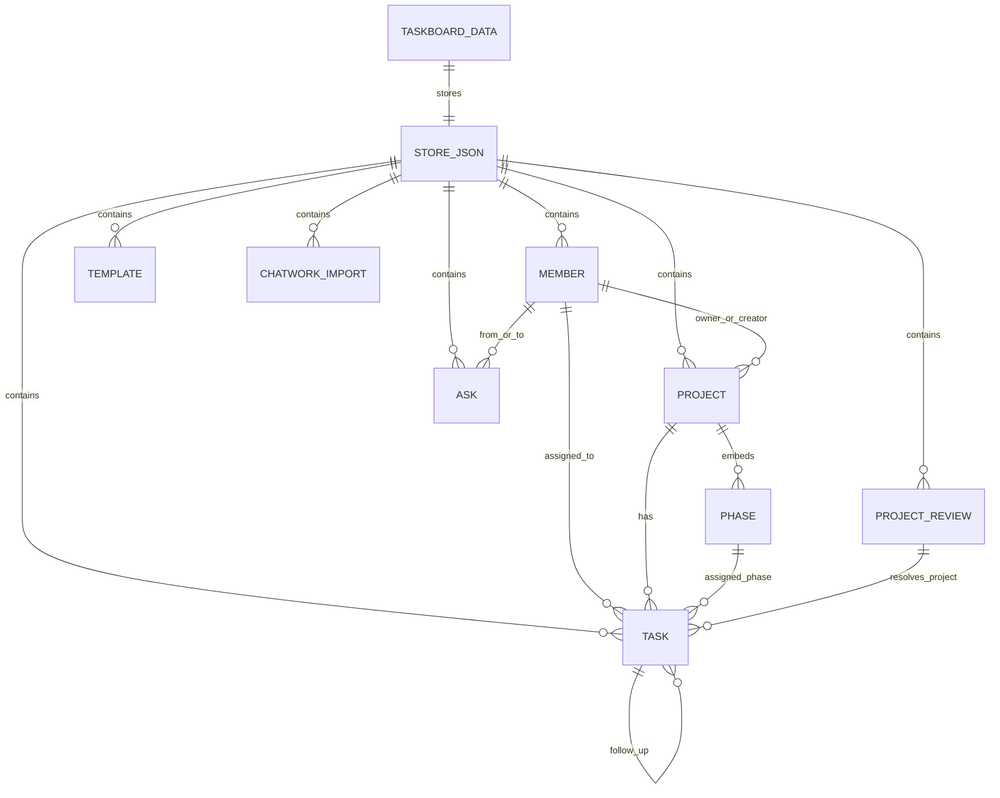

# TaskBoard データベース定義書

更新日: 2026-06-24

## 全体像

TaskBoard は、Supabase 上では通常の複数テーブル構成ではなく、`taskboard_data` という 1 つのテーブルにアプリ全体のデータを JSON として保存しています。

その JSON の中に、運用上の「論理テーブル」として `members`、`projects`、`tasks`、`asks` などが入っています。



## 物理テーブル

### taskboard_data

Supabase に存在する実テーブルです。

| カラム | 型 | 内容 |
|---|---|---|
| `id` | text | 保存行のID。現在は常に `main` |
| `data` | json/jsonb | アプリ全体のデータ |
| `updated_at` | timestamp | 最終保存日時 |

想定SQL:

```sql
create table if not exists public.taskboard_data (
  id text primary key,
  data jsonb not null default '{}'::jsonb,
  updated_at timestamp with time zone default now()
);
```

## JSON内の論理テーブル

`taskboard_data.data` の中身は、おおむね次の形です。

```json
{
  "members": [],
  "projects": [],
  "tasks": [],
  "asks": [],
  "templates": [],
  "chatworkImports": [],
  "projectReviews": [],
  "meta": {}
}
```

## 項目一元管理の方針

同じ意味の情報を、画面ごとに別名で保存しない方針にします。

| 意味 | 正本 | 補足 |
|---|---|---|
| クライアント名 | `projects.clientName` | クライアント選択・プロジェクト表示で共通利用 |
| プロジェクト名 | `projects.name` | タスク側にはコピーせず、`projectId` から参照する |
| 納品日 | `projects.deliveryDate` | プロジェクト全体の最終納品日 |
| 登録者 | `projects.createdByMemberId` | プロジェクトを登録した人 |
| 窓口担当 | `projects.ownerMemberId` | 進行責任者・未担当タスクの初期担当候補 |
| フェーズ | `projects.phases[]` と `tasks.phaseId` | タスクはフェーズIDだけを持つ |
| タスク締切日 | `tasks.dueDate` | その日までに完了する日 |
| 仮締切 | `tasks.dueDateIsTemporary` | Chatwork取込・一括入力などで締切専用値がない場合に、表示日を仮締切として入れた印 |
| 日別表示日 | `tasks.displayDate` | 今日のタスク画面に出す日。繰り越しではこの値だけを移動する |
| タスク開始日 | `tasks.startDate` | 未設定時は締切日と遂行期間から補う |
| 遂行期間 | `tasks.durationDays` | 開始日から締切日までの営業日数 |
| 工数 | `tasks.estimatedHours` | 予定時間。日別負荷では期間内の営業日に按分する |
| テンプレート締切計算 | `templates.tasks[].offset` | 納品日から何営業日前に締切を置くか |

`tasks.date` は旧データ互換のため残します。新規保存では `tasks.dueDate` と同じ値を入れ、日別タスクの表示・繰り越し判断には `tasks.displayDate` を使います。

タスク追加、プロジェクト内タスク追加、テンプレート展開、一括入力、Chatwork取込、ガントは、すべて同じ `tasks.startDate`、`tasks.durationDays`、`tasks.dueDate` を参照します。各画面専用の日程コピーは作りません。

## members

メンバー情報です。タスク担当者、窓口、登録者、Chatwork投稿者の照合に使います。

| 項目 | 内容 |
|---|---|
| `id` | メンバーID |
| `name` | 表示名 |
| `color` | 表示色 |
| `chatworkAccountId` | ChatworkアカウントID |
| `createdAt` | 作成日 |

## projects

プロジェクト情報です。タスクの親になります。

| 項目 | 内容 |
|---|---|
| `id` | プロジェクトID |
| `clientName` | クライアント名 |
| `name` | プロジェクト名 |
| `deliveryDate` | 納品日 |
| `budget` | 予算 |
| `projectType` | `standard` / `recurring` / `provisional` |
| `recurringSeries` | 定期案件名 |
| `ownerMemberId` | 窓口担当メンバーID |
| `createdByMemberId` | 登録者メンバーID。互換性のためフィールド名は createdBy のまま |
| `dealCategory` | 案件区分。既存クライアント / 提案系など |
| `leadSource` | 案件流入元。問い合わせ・紹介・代理店・媒体などのチャネル |
| `leadSourceDetail` | 案件流入元の詳細。フォーム名、紹介元、媒体名、代理店名など |
| `startDate` | 開始日。未設定の場合はタスク日付から補う運用 |
| `isProvisional` | 仮プロジェクトかどうか |
| `detailsDueAt` | 不足情報の確認期限 |
| `projectStatus` | `active` / `completed` など |
| `note` | プロジェクト備考 |
| `archived` | アーカイブ済みか |
| `createdAt` | 作成日 |
| `phases` | フェーズ配列 |

## projects.phases

プロジェクト内に埋め込まれているフェーズ情報です。独立したSupabaseテーブルではありません。

| 項目 | 内容 |
|---|---|
| `id` | フェーズID |
| `name` | フェーズ名 |
| `status` | `pending` / `active` / `done` |
| `startDate` | フェーズ開始日 |
| `dueDate` | フェーズ締切日 |
| `order` | 表示順 |

## tasks

タスク情報です。今日のタスク、繰り越し、完了状態、プロジェクト紐付けに使います。

| 項目 | 内容 |
|---|---|
| `id` | タスクID |
| `dueDate` | タスク締切日。この日までに完了する |
| `displayDate` | 日別タスク画面に表示する日。繰り越し時はこの値だけを今日へ移動する |
| `date` | 旧データ互換用。新規保存では `dueDate` と同じ値を持つ |
| `startDate` | タスク開始日。未設定の場合は締切日と遂行期間から補う |
| `originalDate` | 未完了で日を跨いだ場合の元の表示日 |
| `memberId` | 担当者メンバーID |
| `projectId` | 紐付くプロジェクトID |
| `phaseId` | 紐付くフェーズID |
| `content` | タスク内容 |
| `estimatedHours` | 予定時間 |
| `durationDays` | 遂行期間（日数）。開始日から締切日までの営業日数 |
| `dueDateIsTemporary` | 締切が仮設定かどうか。Chatwork取込・一括入力では、締切専用の値がないため作業日を仮締切として保存する |
| `taskType` | 手動作成: 作業、依頼、修正、納品、確認、進行許可。自動作成: 再確認 |
| `reviewConfigMode` | `inherit` プロジェクト・フェーズ設定を使用 / `custom` タスク専用 |
| `reviewerMemberIds` | タスク専用の確認者ID配列 |
| `approvalMemberIds` | タスク専用の進行許可者ID配列 |
| `reviewRule` | `inherit` / `all` / `any` |
| `reviewDueDays` | タスク専用の確認期限（日数） |
| `notifyProgressManager` | 進行管理役にも通知するか |
| `scheduleAdjustments` | システムが行った後続日程調整の履歴。原因、バッファー使用日数、移動日数、変更タスク、納品影響を保持 |
| `note` | 備考 |
| `sourceProjectName` | Chatwork等から来た元のプロジェクト名 |
| `needsProjectReview` | プロジェクト確認待ちか |
| `carriedFromTaskId` | 旧仕様の繰り越し元タスクID |
| `carriedOverToTaskId` | 旧仕様の繰り越し先タスクID |
| `completed` | `null` 未確認 / `true` 完了 / `false` 未完了 |
| `incompleteReason` | 未完了理由 |
| `parentTaskId` | 確認・修正・再確認の元タスクID |
| `reviewTaskId` | 修正・再確認を発生させた確認系タスクID |
| `generatedByWorkflow` | 差し戻し・修正完了フローで自動作成されたか |
| `resultStatus` | 確認結果。`ok` / `rejected` / `hold` |
| `rejectionReason` | 差し戻し理由 |
| `holdReason` | 保留理由 |
| `respondedAt` | 最終回答日時 |
| `reservedReviewDueDate` | 差し戻し時に確保した再確認予定日 |
| `scheduleAdjustedAt` | システムによる最終日程調整日時 |
| `scheduleAdjustmentReason` | 日程を自動調整した理由 |
| `dependencyTaskIds` | このタスクを開始する前に完了が必要な前提タスクID配列 |
| `dependencyMode` | `all` 前提をすべて完了 / `any` 前提のどれかを完了 |
| `mergedIntoTaskId` | 重複整理で統合先になったタスクID。設定済みのタスクは通常表示から外す |
| `mergedAt` | 重複整理で統合した日時 |
| `createdAt` | 作成日時 |

## asks

システムが作成する確認開始通知、進行許可通知、日程変更通知と、過去に登録された確認依頼を保持するデータです。

新しい確認作業は `asks` へ手入力せず、期限・担当者・工数を持つ `tasks` の確認系タスクとして管理します。

同じ種別・同じ宛先・同じ関連タスクの未完了通知は新規作成せず、既存通知を更新します。過去データに残っている重複通知は、起動時に1件へ整理します。

| 項目 | 内容 |
|---|---|
| `id` | 確認ID |
| `type` | 種別。例: 質問、お願い、確認、進行許可 |
| `fromMemberId` | 依頼元メンバーID |
| `toMemberId` | 依頼先メンバーID |
| `toName` | 依頼先名。全員など |
| `content` | 内容 |
| `projectId` | 関連プロジェクトID |
| `projectName` | 関連プロジェクト名 |
| `taskId` | 関連タスクID |
| `dueDate` | 確認期限。カレンダーで選択する日付 |
| `dueText` | 旧データ互換用。新規保存では `dueDate` と同じ日付 |
| `status` | `open` / `done` / 今後候補: `rejected` |
| `date` | 登録日 |
| `createdAt` | 作成日時 |

## templates

プロジェクトテンプレートです。プロジェクト作成時にフェーズを作るために使います。

| 項目 | 内容 |
|---|---|
| `id` | テンプレートID |
| `name` | テンプレート名 |
| `phases` | フェーズ名の配列 |
| `tasks` | 標準タスクの配列。タスク名、フェーズ、営業日前、遂行期間（日）、工数、確認設定を持つ |
| `custom` | ユーザー作成テンプレートか |

## chatworkImports

Chatworkからの重複取り込みを防ぐための履歴です。

| 項目 | 内容 |
|---|---|
| `key` | `roomId:messageId` |
| `roomId` | ChatworkルームID |
| `messageId` | ChatworkメッセージID |
| `accountName` | 投稿者名 |
| `taskCount` | 取り込んだタスク数 |
| `askCount` | 取り込んだ確認数 |
| `importedAt` | 取り込み日時 |

## projectReviews

Chatworkから来たタスクのプロジェクト名が既存プロジェクトと一致しない場合の確認待ちデータです。

| 項目 | 内容 |
|---|---|
| `id` | 確認ID |
| `roomId` | ChatworkルームID |
| `messageId` | ChatworkメッセージID |
| `accountName` | 投稿者名 |
| `memberId` | 紐付いたメンバーID |
| `groups` | 確認対象グループ |
| `status` | `open` / `resolved` |
| `createdAt` | 作成日時 |
| `resolvedAt` | 解決日時 |

### projectReviews.groups

| 項目 | 内容 |
|---|---|
| `sourceProjectName` | Chatworkに書かれたプロジェクト名 |
| `taskIds` | 対象タスクID配列 |
| `suggestionProjectIds` | 類似候補プロジェクトID配列 |

## meta

アプリ全体の補助情報です。

| 項目 | 内容 |
|---|---|
| `lastDate` | 最後に日付処理した日 |

## 現状の注意点

- 実DBは1テーブルなので、Supabaseの画面だけを見ると `taskboard_data` しか見えません。
- `projects.phases` はプロジェクト内に埋め込まれています。
- `tasks.date` は旧データ互換用です。新しい正本は `tasks.dueDate` と `tasks.displayDate` です。
- `tasks.projectId` が空、または `needsProjectReview: true` のタスクは、プロジェクト確認待ちです。
- 過去の運用で作られた `isProvisional: true` のプロジェクトがあるため、プロジェクト一覧に「仮プロジェクト」が多く表示されることがあります。
- 今後データ量や権限管理が増える場合は、`members`、`projects`、`tasks` などをSupabaseの個別テーブルに分ける設計も検討できます。

## 今後のデータ設計候補

制作進行・負荷管理を新アプリとして切り出す場合は、次のようなデータを追加・分離する候補があります。

| 候補 | 内容 |
|---|---|
| `taskKind` | `work` / `review` / `approval` / `revision` / `recheck` |
| `startDate` | 着手開始日 |
| `dueDate` | 締切日 |
| `displayDate` | 日々の個人タスク画面に出す日 |
| `parentTaskId` | 確認・修正・再確認の元タスク |
| `resultStatus` | `ok` / `rejected` / `pending` |
| `rejectionReason` | 差し戻し理由 |
| `capacityHoursByMember` | メンバーごとの1日稼働上限 |
| `unavailableDates` | 休み、外出、固定業務など |

## データ整理で確認する状態

アプリの「データ整理」画面では、以下を確認します。

| 確認項目 | 判定条件 | 主な対応 |
|---|---|---|
| 未紐付けタスク | `projectId` が空、存在しない、または `needsProjectReview: true` | 正式プロジェクトへ紐付け |
| 仮プロジェクト | `isProvisional: true`、`projectType: provisional`、または名称に `仮プロジェクト` を含む | 正式プロジェクトへ統合、またはアーカイブ |
| クライアント表記ゆれ | `projects.clientName` に複数の表記が存在 | 統合先クライアント名を選び、対象プロジェクトの `clientName` を一括置換 |
| 繰り越し不整合 | `carriedFromTaskId` / `carriedOverToTaskId` の参照先がない、または完了状態が食い違う | リンク解除、繰り越し先も完了、タスク編集 |
| フェーズ不整合 | `phaseId` があるが、対象プロジェクト内にそのフェーズがない | フェーズ解除、またはタスク編集 |
| 不足情報プロジェクト | 登録者、窓口、納品日、定期案件名などが不足 | プロジェクト編集で補完 |

クライアントは独立したテーブルではなく、各プロジェクトの `clientName` 文字列として保存しています。
そのため、クライアント整理は「クライアント行を削除する」のではなく、その名前を使っているプロジェクトの `clientName` を正式名称へ置き換える処理です。

## 2026-07-13 追記: タスク種別・確認・待ち管理フィールド

`tasks` には、従来の `taskType` に加えて、日々の入力負荷を下げるための運用フィールドを追加する。

| 項目 | 内容 |
|---|---|
| `taskMode` | `project` / `self` / `review_required` / `waiting` / `review_assigned` |
| `categoryName` | 過去互換用。自己完結タスクの新規入力では使わない |
| `isRecurringSelfTask` | 自己完結タスクを未来予定として作るか |
| `recurrenceFrequency` | 自己完結タスクの繰り返し設定。空 / `business_daily` / `weekly` / `monthly` / `custom_next` |
| `recurrenceEndDate` | 日次・週次・月次の繰り返し終了日 |
| `recurrenceNextDate` | `custom_next` の次回日 |
| `reviewerMemberId` | 確認してもらう作業の確認者 |
| `reviewDueDate` | 確認者側の確認締切 |
| `plannedReviewTaskId` | 自動作成された確認タスクID |
| `reviewStatus` | 確認タスク作成・回答状態の補助情報 |
| `waitingFor` | 確認待ち・追いかけの待ち先 |
| `waitReason` | 待ち理由 |
| `nextCheckDate` | 次に確認する日 |
| `temporaryDueReason` | 仮締切理由 |
| `temporaryDueCheckDate` | 仮締切の次回確認日 |

`dueDate` は必須とし、未定の場合も仮の日付を入れる。`dueDateIsTemporary = true` の場合は、理由と次回確認日を持つ。
